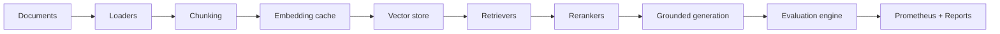

# Architecture

The platform is organized as an internal LLMOps product:

Core boundaries:

- `app/api`: versioned FastAPI endpoints and dependency wiring.
- `app/services`: orchestration services with persistence and observability hooks.
- `app/rag`: chunking, embedding, vector stores, retrieval, reranking, generation, and LangGraph workflow scaffolding.
- `app/evaluation`: retrieval, generation, hallucination, and performance metrics.
- `app/database`: SQLAlchemy models, repositories, and Alembic migrations.

